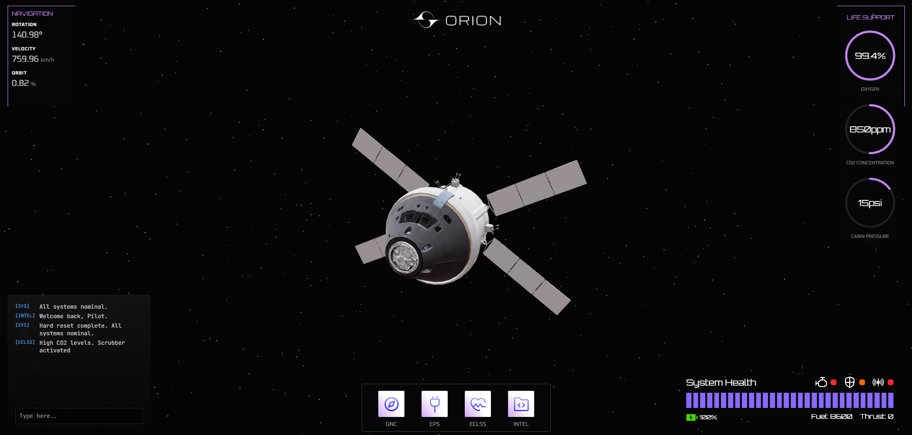
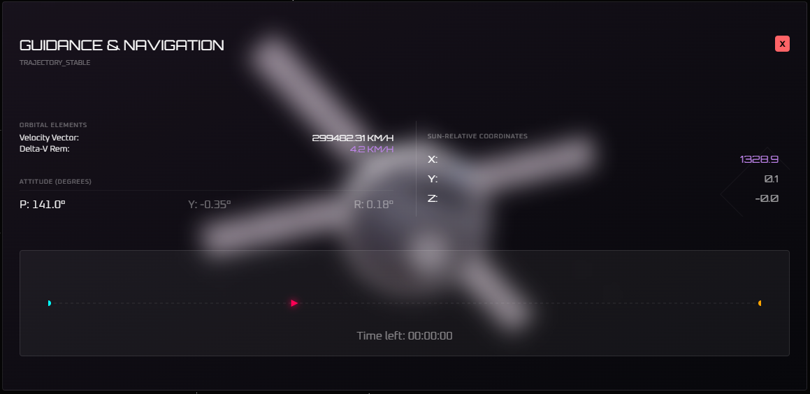
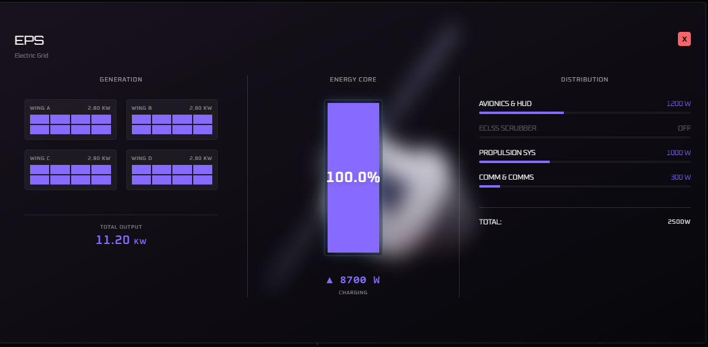
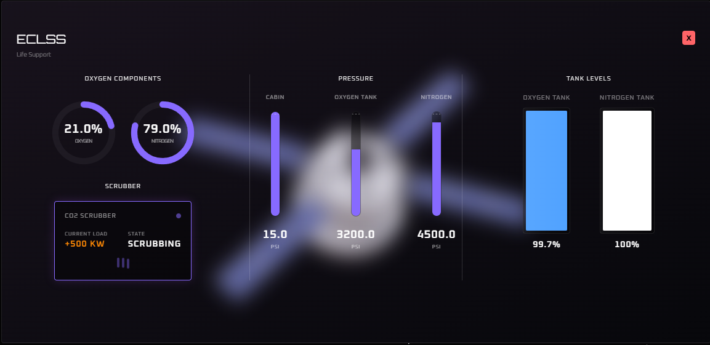
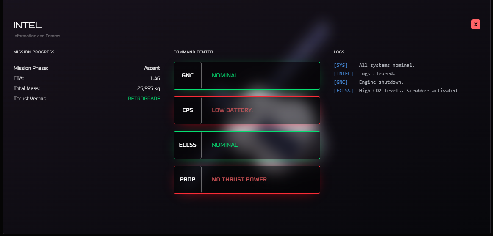

## **Orion Artemis II Mission Control Dashboard & Spacecraft Systems Simulator**
A high-fidelity mission control and systems simulator for the Orion spacecraft, modeled after the Artemis II mission profile. This platform serves as a research environment for AI-assisted system diagnostics in deep-space environments.

### Resources
- [NASA Systems Engineering Handbook](https://www.isibang.ac.in/~library/onlinerz/resources/NASAengineeringhandbookpdf.pdf)
- [NASA ECLSS](https://www.nasa.gov/reference/environmental-control-and-life-support-systems-eclss/)
- [NASA GNC](https://www.nasa.gov/smallsat-institute/sst-soa/guidance-navigation-and-control/)
- [NASA Rocket Thrust](https://www.grc.nasa.gov/www/k-12/airplane/rktthsum.html)
- [Atomic Rockets (Project Rho)](https://projectrho.com/public_html/rocket/)

### Screenshots
**Main Dashboard**:

**GNC System**:

*Technical specifications and logic: [My GNC Documentation](docs/notes.md#gnc-guidance-navigation-and-control).*

**EPS System**:

*Technical specifications and logic: [My EPS Documentation](docs/notes.md#eps-electrical-power-system).*

**ECLSS System**:

*Technical specifications and logic: [My ECLSS Documentation](docs/notes.md#eclss-environment-control-and-life-support-system).*

**Intel System**:

