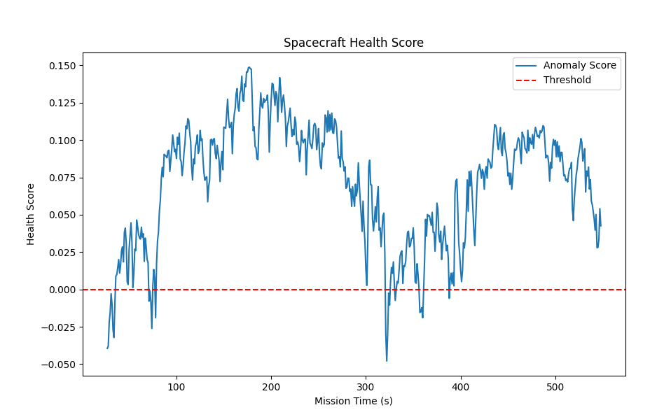

### Research Notes
The first model used for anomaly detection is Isolation Forest. This is a variant of a Random Forest but optimised to look for outliars in our data. Instead of standard decision trees, it uses Random Partitions to isolate points which assigns each data point a score called *anomaly score*. In the model config we set a contamination parameter that represents our threshold for detecting anomalies.

#### Example
A contamination value of 0.05 means that the model takes the most 5% isolated data points and classifies as anomalies.

Because Isolation Forests are based on Random Forest, they share the same principle, splitting data upon features. If a data point is normal, it will take many splits to isolate it but for the anomalies it will be easy to isolate because they're far from other data points. 

Isolation Forests scores are based on the path length.
Here we use `model.decision_function(X)` to get values between -0.5 and 0.5 instead of simple Yes/No (1 for normal, -1 for anomaly) values. The higher the value, the more average and safe the telemetry data is. On the opposite side, the more negative the number, the more extreme the leak or the drain from the ship is.

#### Example
If the oxygen levels on the ship are rapidly decreasing, the predictions (model.fit_predict) might still say 1 (not anomaly) because they didn't hit that 5% threshold yet. However, looking at the scores we can see that the values are dropping towards zero and that can raise an alert before tripping the actual oxygen leaking alarm.

### First Attempt

As we can see, even though the model was trained on clean data (no malfunctions) negative scores were still present. My guess is that the contamination rate was too high for this specific dataset.